# weweb-cloudflare-ci
⭐ First open-source CI/CD template for WeWeb + Cloudflare Pages

Production-ready automated deployment pipeline using GitHub Actions and Cloudflare Workers with commit traceability and automatic build fixes.

[](https://github.com/Mel000000/weweb-cloudflare-ci/actions)
[](LICENSE)

[](https://github.com/Mel000000/weweb-cloudflare-ci/stargazers)

This workflow ensures fully automated deployment of WeWeb projects with commit traceability and Vite build overrides.

---

## Table of Contents

- [Overview](#overview)
- [Why This Template Matters](#why-this-template-matters)
- [Who This Is For](#who-this-is-for)
- [Why This Project Exists](#why-this-project-exists)
- [Usage Example](#usage-example)
- [Architecture](#architecture)
- [Features](#features)
- [Quick Start](#quick-start)
- [Prerequisites Checklist](#prerequisites-checklist)
- [Setup Secrets](#setup-secrets)
- [Configure WeWeb](#configure-weweb)
- [Workflow Steps](#workflow-steps)
  - [1. Cloudflare Worker triggers workflow](#1-cloudflare-worker-triggers-workflow)
  - [2. Workflow listens for repository_dispatch](#2-workflow-listens-for-repository_dispatch-events)
  - [3. Clone the WeWeb project](#3-clone-the-weweb-project)
  - [4. Extract WeWeb commit info](#4-extract-weweb-commit-info)
  - [5. Apply file templates and polyfills](#5-apply-file-templates-and-polyfills)
  - [6. Install dependencies](#6-install-dependencies)
  - [7. Build the project](#7-build-the-project-using-viteoverridejs)
  - [8. Inject WeWeb commit info (optional)](#8-inject-weweb-commit-info-into-distgit-infojs-optional)
  - [9. Commit changes](#9-commit-changes-in-deploy-repo-using-original-weweb-commit-message)
  - [10. Deploy to Cloudflare Pages](#10-deploy-to-cloudflare-pages)
- [Commit Traceability](#commit-traceability)
- [Troubleshooting](#troubleshooting)
- [License](#license)

---

## Overview

This repository provides a **hands-off, fully automated deployment workflow** for WeWeb projects.  

### Repository Structure
- **📦 Workflow Repository** (this one): Contains CI/CD configuration, Cloudflare Worker code, and deployment logic
- **📦 WeWeb Project Repository**: Your actual WeWeb project code (exported from WeWeb)

### Why Two Repos?
1. **Workflow Repo** - The "control center" that orchestrates the deployment
2. **Project Repo** - The "source of truth" for your WeWeb project files


### Key challenges addressed:
- WeWeb overwrites configuration files on export, which can break builds.  
- Keeping track of original WeWeb commit messages during deployment.  
- Automatically applying polyfills and Vite overrides to ensure builds succeed.  

The workflow clones the latest WeWeb export, applies necessary overrides, builds the project, and deploys it to Cloudflare Pages with accurate commit traceability.

---
## Why This Template Matters

WeWeb currently has no official CI/CD templates for Cloudflare Pages.

This repository provides a production-tested reference architecture for reliable automated deployments.

---
## Who This Is For

This project is ideal for:

- Developers deploying WeWeb to Cloudflare Pages
- Teams needing automated WeWeb CI/CD
- Projects requiring reproducible WeWeb builds

This project may NOT be ideal if:

- You deploy manually from WeWeb
- You use Netlify or Vercel instead of Cloudflare
- You don't need CI automation
---
## Why This Project Exists

WeWeb exports often overwrite configuration files, making standard CI/CD pipelines unreliable.

This project provides a robust deployment architecture that:

- Re-applies required configuration automatically
- Preserves original commit messages
- Works with private WeWeb repositories
- Requires zero manual intervention

The goal was to create a production-ready deployment pipeline that works reliably with WeWeb’s export behavior.
---
## Usage Example
1. Make a change in your WeWeb project and export to your GitHub repo.
2. Cloudflare Worker receives the POST request and triggers the workflow.
3. GitHub Actions workflow clones the WeWeb repo, builds the project, and deploys to Cloudflare Pages.
4. On the deployed site, you can optionally view:
   - `window.WEWEB_COMMIT` — latest WeWeb commit hash
   - `window.WEWEB_MESSAGE` — latest WeWeb commit message

*⚠️ This repository uses placeholder values.
You must configure secrets and environment variables before the workflow will run.*

## Architecture

```mermaid
graph TD
    classDef weweb fill:#6366F1,color:#ffffff,stroke:#333,stroke-width:2px;
    classDef worker fill:#F6821F,color:#ffffff,stroke:#333,stroke-width:2px;
    classDef github fill:#24292E,color:#ffffff,stroke:#333,stroke-width:2px;
    classDef repo fill:#2DBA4E,color:#ffffff,stroke:#333,stroke-width:2px;
    classDef pages fill:#F38020,color:#ffffff,stroke:#333,stroke-width:2px;
    
    A["🎨 WeWeb Editor"]:::weweb
    B["📤 Project Export"]:::weweb
    C["⚡ Cloudflare Worker weweb-trigger"]:::worker
    D["🚀 repository_dispatch event"]:::github
    E["📦 GitHub Actions CI Deploy Workflow"]:::github
    F["🗄️ WeWeb-Project Repository"]:::repo
    G["📁 Static Files (dist)"]:::repo
    H["☁️ Cloudflare Pages Production Site"]:::pages
    
    A -->|1. User triggers export| B
    B -->|2. POST Request| C
    C -->|3. Trigger event| D
    D -->|4. Webhook dispatch| E
    E -->|5. Clones repository| F
    F -->|6. Builds project| G
    G -->|7. Deploys to Cloudflare| H
    H -->|8. Site live! 🎉| A
```

---

## Features

- **Automated CI/CD:** Triggered by WeWeb exports, no manual intervention.  
- **Commit Traceability:** Keeps original WeWeb commit hash and message in deploy repo.  
- **Polyfills & Vite Overrides:** Ensures builds succeed even if WeWeb overwrites configs.  
- **Cloudflare Pages Deployment:** Seamlessly deploys static assets from Vite build.  
- **Optional Commit Info Injection:** Display WeWeb commit info on the deployed site for visibility.  

---

## Quick Start

1. Fork repo
2. Add these secrets:

``CLOUDFLARE_API_TOKEN``
``CLOUDFLARE_ACCOUNT_ID``
``WORKFLOW_PAT``
``WORKER_PAT``
``NPM_TOKEN``

3. Deploy worker:
```bash
wrangler deploy
```
4. Add Worker URL to WeWeb export hook

Done — WeWeb exports will now deploy automatically.

---
## Getting Started

### Prerequisites Checklist

Before setting up this workflow, ensure you have:
- [ ] A WeWeb project with GitHub export configured
- [ ] Two GitHub repositories (workflow and project)
- [ ] A Cloudflare Pages project
- [ ] Cloudflare account with Workers enabled
- [ ] Wrangler CLI installed
- [ ] GitHub Personal Access Token (classic) for Worker trigger = `WORKER_PAT`
- [ ] GitHub Personal Access Token (classic) for npm authentication = `NPM_TOKEN`

### Required Edits

You must modify:

deploy.yml:

- YOUR_ORG/YOUR_REPO
- YOUR_PROJECT_NAME

Cloudflare Worker:

- YOUR_GITHUB_USERNAME_OR_ORG
- YOUR_REPO_NAME

---
### Setup Secrets

In your Workflow Repo and WeWeb Project Repo, configure the following ``GitHub Secrets``:

| Secret Name | Purpose | Required Permissions | Location | Type |
|------------|---------|---------------------|------|------|
| `CLOUDFLARE_API_TOKEN` | Token for Cloudflare Pages deployment | `Cloudflare Pages: Edit` | Workflow Repo and WeWeb Project Repo | Cloudflare API Token |
| `CLOUDFLARE_ACCOUNT_ID` | Cloudflare account ID | - | Workflow Repo and WeWeb Project Repo | Cloudflare |-|
| `WORKFLOW_PAT` | GitHub token for cloning in workflow | `repo` (full control) | Workflow Repo Secrets | GitHub PAT (fine-grained)|
|`WORKER_PAT`| GitHub token for API calls in worker |`repo` and `workflow`| Worker Environment Secrets |GitHub PAT (classic)|
|`NPM_TOKEN`| Allows GitHub Actions to install dependencies during automated builds | `read:packages` | Workflow Repo |GitHub PAT (classic) |

---
## Configure WeWeb
1. In your WeWeb project, go to **Settings → Integrations**
2. Find the **Webhook** or **Export Hook** section
3. Set the URL to your deployed worker: ``https://your-worker.workers.dev`` (or ``https://weweb-trigger.workers.dev`` if you kept the default name)
4. Ensure the webhook triggers **after export**
5. Save the configuration

Now every time you export from WeWeb, it will automatically trigger deployment!

---
## Workflow Steps

### 1. Cloudflare Worker triggers workflow

WeWeb can **send a POST request after a project is exported**.  
The Cloudflare Worker receives that request and triggers the GitHub Actions workflow via the ``repository_dispatch API``.  

**Cloudflare Worker code** (included in this repo, must be deployed manually once using Wrangler):

```javascript
export default {
  async fetch(request, env) {
    const owner = "YOUR_GITHUB_USERNAME_OR_ORG";
    const repo = "YOUR_REPO_NAME";

    const response = await fetch(
      `https://api.github.com/repos/${owner}/${repo}/dispatches`,
      {
        method: "POST",
        headers: {
          Authorization: `Bearer ${env.WORKER_PAT}`,
          "Accept": "application/vnd.github+json",
          "User-Agent": "cloudflare-worker",
          "Content-Type": "application/json"
        },
        body: JSON.stringify({
          event_type: "from-cloudflare",
          client_payload: {
            source: "cloudflare-worker",
            timestamp: new Date().toISOString(),
            customData: "optional custom data"
          }
        })
      }
    );

    return new Response(
      response.ok ? "Workflow triggered" : await response.text(),
      { status: response.ok ? 200 : 500 }
    );
  }
};

```
#### Worker requirements:
- GitHub PAT (Classic) token ``WORKER_PAT`` with the permissions ``repo`` and ``workflow`` in the worker settings of ``weweb-trigger`` in cloudflare as a secret variable
- Ability to deploy via Wrangler CLI (``wrangler deploy``) to make it live
- Optional: ``customData`` payload can carry additional info from WeWeb

*Note: The Worker must be deployed manually before the automated pipeline can be triggered. This step is only done once unless the Worker code is updated.*

#### Deploy the Cloudflare Worker
- Worker code is included in this repo under ``/cloudflare-worker/weweb-trigger/src/index.js``
- The worker acts as the bridge between WeWeb and GitHub Actions:

1. Navigate to the worker directory:
   ```bash
   cd cloudflare-worker/weweb-trigger
   ```
2.  Install Wrangler if not already installed:
   ```bash
   npm install -g wrangler
   ```
3. Set up the GitHub token secret:
   ```bash
   wrangler secret put WORKER_PAT
   ```
4. Deploy manually with Wrangler:
  ```bash
  wrangler deploy
  ```
- Worker triggers the workflow automatically after WeWeb exports

---
### 2. Workflow listens for ``repository_dispatch`` events
The GitHub Actions workflow is configured to run on events of type from-cloudflare and can be found in /.github/workflows/deploy.yml:
```yml
name: WeWeb Production Deploy

on:
  repository_dispatch:
    types: [from-cloudflare]
  workflow_dispatch: # optional: allows manual trigger for testing

jobs:
  deploy:
    runs-on: ubuntu-latest

    steps:
      # Step 1: Checkout this repo
      - name: Checkout workflow repo
        uses: actions/checkout@v4

      # Step 2: Fetch WeWeb source files into a folder named source-content (🔴 adjust directory as needed)
      - name: Clone WeWeb repo
        run: |
          git clone --branch main https://${{ secrets.GITH_TOKEN }}@github.com/YOUR_ORG/YOUR_REPO.git source-content
      
      # Step 3: Extract latest commit info from WeWeb repo and set as environment variables
      - name: Get WeWeb commit info
        run: |
          cd source-content
          # Latest commit hash
          GIT_HASH=$(git rev-parse --short HEAD)
          # Latest commit message (single line)
          GIT_MSG=$(git log -1 --pretty=%B | tr '\n' ' ')
          echo "WEWEB_COMMIT=$GIT_HASH" >> $GITHUB_ENV
          echo "WEWEB_MESSAGE=$GIT_MSG" >> $GITHUB_ENV

      - name: Show Trigger Info
        if: github.event_name == 'repository_dispatch'
        run: |
          echo "::notice::Triggered by Cloudflare Worker"
          echo "Source: ${{ github.event.client_payload.source }}"
          echo "Time: ${{ github.event.client_payload.timestamp }}"

      # Step 4: create main.js with Buffer polyfill if it doesn't exist, or prepend the polyfill if it does
      - name: Apply main.js templates
        run: |
          # Patch main.js: if exists, prepend Buffer polyfill; if not, create
          MAIN_FILE=source-content/src/main.js
          if [ -f "$MAIN_FILE" ]; then
            # Prepend the Buffer polyfill
            cat .github/templates/main.js "$MAIN_FILE" > "$MAIN_FILE.tmp" && mv "$MAIN_FILE.tmp" "$MAIN_FILE"
          else
            # Create new main.js with Buffer polyfill
            cp .github/templates/main.js "$MAIN_FILE"
          fi


      # Step 5: Setup Node and install dependencies
      - name: Setup Node
        uses: actions/setup-node@v4
        with:
          node-version: 18
          
      - name: Configure npm auth
        run: |
          echo "//registry.npmjs.org/:_authToken=${{ secrets.NPM_TOKEN }}" > ~/.npmrc
      
      - name: Install dependencies
        run: |
          set -e
          cd source-content
          npm install

      - name: Install missing Vite deps
        run: |
          cd source-content
          npm install rollup-plugin-node-polyfills --save-dev
      
      # Step 6: Copy Vite override config into project
      - name: Copy Vite override into project
        run: |
          cp .github/wrappers/vite.override.js source-content/vite.override.js
      
      # Step 7: Build project
      - name: Build project
        run: |
          echo "::notice:: Building project..."
          cd source-content
          npx vite build --config vite.override.js
      
      # Step 8: Inject WeWeb commit info into build (optional for site visibility)
      - name: Inject WeWeb commit info into dist
        run: |
          echo "window.WEWEB_COMMIT='$WEWEB_COMMIT'; window.WEWEB_MESSAGE='$WEWEB_MESSAGE';" > source-content/dist/git-info.js
      
      # Step 9: Configure git and commit with WeWeb message
      - name: Configure git and commit
        run: |
          git config --local user.email "action@github.com"
          git config --local user.name "GitHub Action"
          git config --local advice.addEmbeddedRepo false
          git add .
          git commit -m "$WEWEB_MESSAGE" || echo "No changes to commit"

      # Step 10: Deploy to Cloudflare Pages (🔴 adjust projectName)
      - name: Deploy to Cloudflare Pages
        uses: cloudflare/pages-action@v1
        with:
          apiToken: ${{ secrets.CLOUDFLARE_API_TOKEN }}
          accountId: ${{ secrets.CLOUDFLARE_ACCOUNT_ID }}
          projectName: YOUR_PROJECT_NAME
          directory: source-content/dist
          wranglerVersion: 2

      # Deployment success message
      - name: Deployment Summary
        run: |
          echo "## Deployment Successful" >> $GITHUB_STEP_SUMMARY
          echo "" >> $GITHUB_STEP_SUMMARY
          echo "- Environment: Production" >> $GITHUB_STEP_SUMMARY
          echo "- Trigger: weweb-trigger (Cloudflare Worker)" >> $GITHUB_STEP_SUMMARY
          echo "- WeWeb Commit: $WEWEB_COMMIT" >> $GITHUB_STEP_SUMMARY
          echo "- WeWeb Message: $WEWEB_MESSAGE" >> $GITHUB_STEP_SUMMARY
          echo "- Status: Success ✅" >> $GITHUB_STEP_SUMMARY
      
      # Deployment info
      - name: Deployment Info
        run: |
          echo "::notice:: Deploying WeWeb commit $WEWEB_COMMIT"
          echo "::group::Deployment Details"
          echo "Commit: $WEWEB_COMMIT"
          echo "Message: $WEWEB_MESSAGE"
          echo "::endgroup::"
      
      # Error handling      
      - name: Handle Deployment Errors
        if: failure()
        run: |
          echo "::error::❌ Deployment failed"
          echo "::group::Error Details"
          echo "Commit: $WEWEB_COMMIT"
          echo "Message: $WEWEB_MESSAGE"
          echo "::endgroup::"

          echo "## Deployment Failed" >> $GITHUB_STEP_SUMMARY
          echo "" >> $GITHUB_STEP_SUMMARY
          echo "- Environment: Production" >> $GITHUB_STEP_SUMMARY
          echo "- WeWeb Commit: $WEWEB_COMMIT" >> $GITHUB_STEP_SUMMARY
          echo "- WeWeb Message: $WEWEB_MESSAGE" >> $GITHUB_STEP_SUMMARY
          echo "- Status: Failed ❌" >> $GITHUB_STEP_SUMMARY
```

---
### 3. Clone the WeWeb project
The workflow clones the latest WeWeb repo into a temporary folder (``source-content``) using the ``WORKFLOW_PAT`` secret.

---
### 4. Extract WeWeb commit info
The workflow reads the latest commit hash and message from the cloned repo and stores it as environment variables for use in the deploy commit and optional site display.

---
### 5. Apply file templates and polyfills
- ``main.js`` polyfill prepended or created if missing; can be found in ``/.github/templates/main.js``:
  ```javascript
  import { Buffer } from 'buffer'
  window.Buffer = Buffer
  ```
- Vite configuration override (``vite.override.js``) applied to ensure builds succeed; can be found in ``/.github/wrappers/vite.override.js``:
  ```javascript
  import { defineConfig, mergeConfig } from 'vite'
  import baseConfig from './vite.config.js'
  
  export default defineConfig((env) => {
    const resolvedBase =
      typeof baseConfig === 'function'
        ? baseConfig(env)
        : baseConfig
  
    return mergeConfig(resolvedBase, {
      define: {
        global: {},
        'process.env': {}
      },
  
      resolve: {
        alias: {
          buffer: 'buffer'
        }
      },
  
      optimizeDeps: {
        include: ['buffer', 'process']
      }
    })
  })
  ```
  
---
### 6. Install dependencies
- Node.js (v18) installed
- Dependencies installed via ``npm install``
- Authenticated using ``NPM_TOKEN``
- Additional Vite-specific packages installed as needed
  
---
### 7. Build the project using ``vite.override.js``
Build the production-ready static assets using Vite with the override config.

---
### 8. Inject WeWeb commit info into dist/git-info.js (optional)
The workflow can generate dist/git-info.js containing:
```javascript
window.WEWEB_COMMIT = "commit_hash";
window.WEWEB_MESSAGE = "commit_message";
```
This allows site-level display of WeWeb commit info.

---
### 9. Commit changes in deploy repo using original WeWeb commit message
The workflow commits the newly built assets with the original WeWeb commit message for traceability.

---
### 10. Deploy to Cloudflare Pages
Deploys the contents of ``dist`` using ``cloudflare/pages-action@v1``.

### After initial setup, all WeWeb exports automatically propagate to Cloudflare Pages without manual intervention.

---
## Commit Traceability
- Original WeWeb commit hash and message are preserved
- Deploy repo commits reflect WeWeb changes, not workflow repo edits
- Optional site visibility through git-info.js

### Getting notifications about deploy status (optional)
- By configuring the ``watch setting`` of the deploy repo to "All Activity" and allow notifications to be send to your GitHub/ email (Profile -> Settings -> Notifications -> Actions), you get notified everytime the pipeline gets run and if it succeded
- further information about the current commit from weweb can be seen in the workflow logs
---

## Troubleshooting

| Issue | Likely Cause | Solution |
|-------|--------------|----------|
| Workflow not triggering | Worker not deployed or WRONG `WORKER_PAT` | Check worker deployment and verify PAT permissions |
| Clone failing | `WORKFLOW_PAT` missing or incorrect | Ensure PAT has `repo` scope |
| Build failing | Missing Vite config | Verify `vite.override.js` exists |
| Deployment failing | Cloudflare token invalid | Check `CLOUDFLARE_API_TOKEN` permissions |

---
## License

This project is licensed under the MIT License. See the [LICENSE](LICENSE) file for details.
